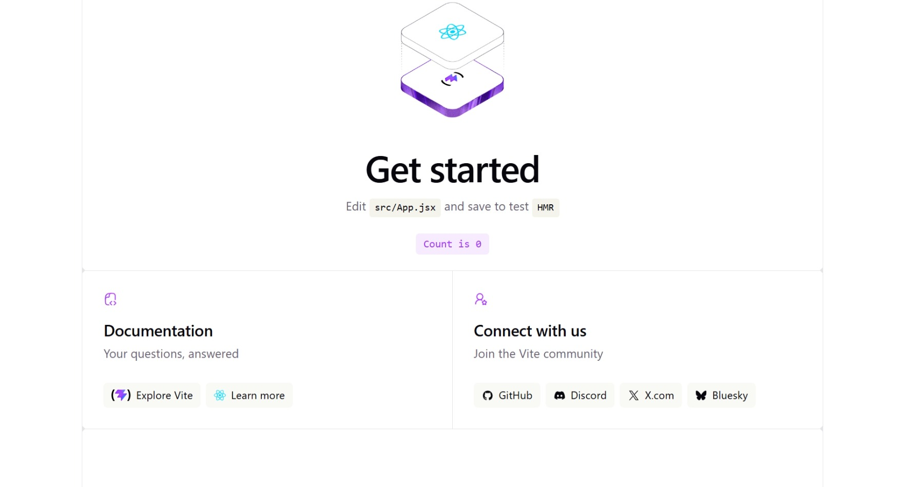
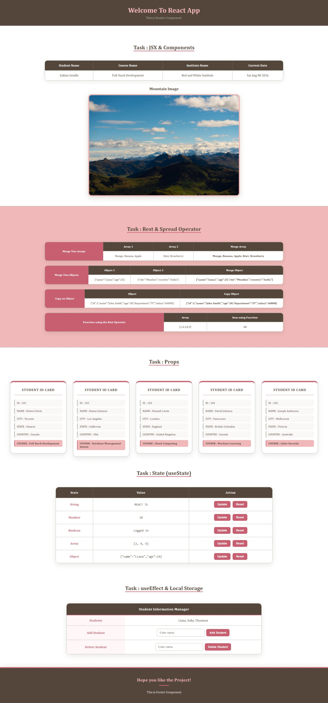
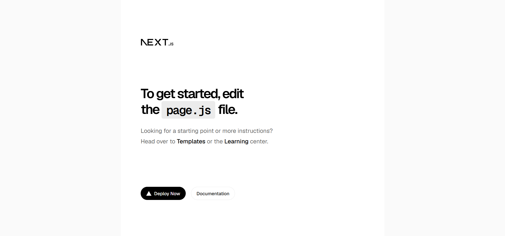
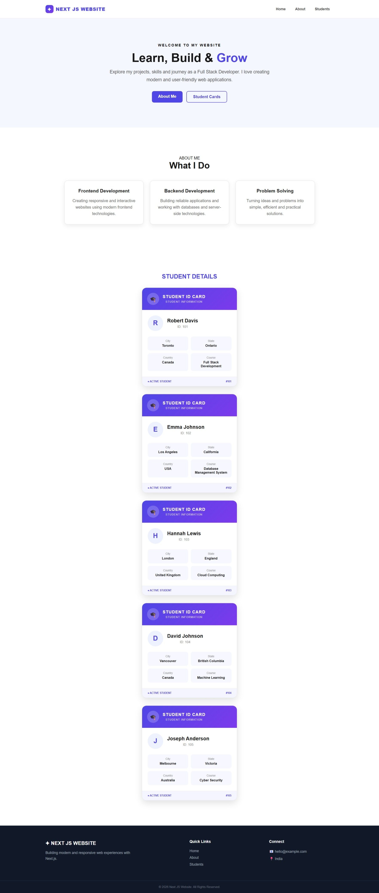
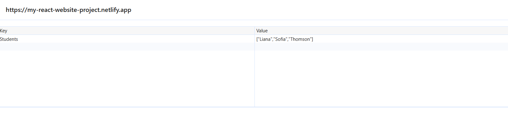

# Project : Scratching React

**A hands-on practical assignment covering React.js (Vite) and Next.js fundamentals — components, JSX, Rest & Spread operators, Props, useState, useEffect, and Local Storage — built through 7 progressive practical tasks.**

---

## 📑 Table of Contents

- [Project Description](#-project-description)
- [How This Project is Made](#-how-this-project-is-made)
- [Features](#-features)
- [Technologies Used](#-technologies-used)
- [Concepts Covered](#-concepts-covered)
- [How It Works](#-how-it-works)
- [Screenshot](#-screenshot)
- [Demo](#-demo)
- [Author](#-author)

---

## 📌 Project Description

This repository contains a set of **7 practical tasks** built to strengthen core React and Next.js concepts. It includes a React project (built with **Vite**) and a separate **Next.js** project, together demonstrating component-based architecture, JSX rendering, the Rest & Spread operators, props-based reusable components, state management with `useState`, side effects with `useEffect`, and data persistence using Local Storage.

Both apps are deployed live, and every core concept — from environment setup to a fully working Student Information Manager with Local Storage — is demonstrated through small, focused components.

---

## 🚀 How This Project is Made

This project is built using **React.js (Vite)** and **Next.js** to practice and demonstrate core front-end development concepts.

### ⚛️ React Project (Vite)
- Bootstrapped using `npm create vite@latest`.
- Functional components used throughout (Header, Welcome Section, Footer, Student Card, etc.).
- JSX used for rendering nested and dynamic elements.
- `useState` used to manage string, number, boolean, array, and object state.
- `useEffect` combined with **Local Storage** to build a persistent Student Information Manager.

### ▲ Next.js Project
- Bootstrapped using `npx create-next-app@latest`.
- **Home** and **About** are built as sections on a single page, linked using anchor `id`s (e.g. `#home`, `#about`) instead of separate routes.
- A reusable **Student Card** component built with Props, used to render a list of students.

### 🎨 Styling
- Basic CSS used for layout, spacing, and card-based UI design.
- Simple, clean, and responsive component structure.

---

## ✨ Features

- React (Vite) project with Header, Welcome Section, and Footer components
- Displays Student Name, Course, Institute Name, Current Date, and an Image
- Rest & Spread Operator examples (arrays, objects, functions)
- Reusable Student Card component using Props (5+ student cards)
- `useState` examples for String, Number, Boolean, Array, and Object with Add/Update and Reset buttons
- Student Information Manager using `useEffect` + Local Storage (Add, Display, Delete, Persist on Refresh)
- Separate Next.js app with Home Page, About Page, and a Students list using a reusable Student Card component

---

## 🛠️Technologies Used

- HTML5
- CSS3
- JavaScript (ES6)
- React.js (Vite)
- Next.js
- Local Storage (Web Storage API)

---

## 📚 Concepts Covered

- Node.js, npm/npx/yarn
- React Installation (Vite)
- Next.js Installation & File-based Routing
- JSX, Rendering Elements, Nested Elements, Attributes, Comments
- Functional Components
- Rest Operator
- Spread Operator
- Props & Reusable Components
- State Management with `useState`
- Side Effects with `useEffect`
- Local Storage (store & retrieve data)

---

## ⚙️ How It Works

### Task 1 – Environment Setup
- Node.js and VS Code installed locally.
- React project created using `npm create vite@latest`.
- Next.js project created using `npx create-next-app@latest`.
- Both projects run successfully using `npm run dev`.

### Task 2 – JSX & Components
- `Header`, `WelcomeSection`, and `Footer` functional components created.
- Displays Student Name, Course, Institute Name, current date (via `new Date()`), and an image.

### Task 3 – Rest & Spread Operator
- Merges two arrays using the spread operator (`[...arr1, ...arr2]`).
- Merges two objects using the spread operator (`{...obj1, ...obj2}`).
- Copies an object using the spread operator.
- A function built with the rest operator (`...args`) to accept variable arguments.
- All outputs rendered directly on the page.

### Task 4 – Props
- A reusable `StudentCard` component accepts `name`, `city`, `state`, `country`, and `course` as props.
- 5 student cards rendered using the same component with different data.

### Task 5 – State (`useState`)
- Separate examples for String, Number, Boolean, Array, and Object state.
- Each example includes an **Update** button and a **Reset** button.

### Task 6 – useEffect & Local Storage
- A **Student Information Manager** app:
  - Add a student name via an input field.
  - Display the list of added students.
  - Store the list in Local Storage using `useEffect`.
  - Automatically retrieve the list from Local Storage on page refresh.
  - Delete a student from the list.

### Task 7 – Next.js Basics
- **Home** and **About** sections are placed on the same page, each wrapped in a container with a unique `id` (e.g. `id="home"`, `id="about"`) and linked via anchor navigation (`<a href="#about">`).
- A **Students** section/page displays a list of students.
- A reusable `StudentCard` component (built with Props) is used to render each student.

---

## 📸 Screenshot

### React App — Editor View

### React App — Live Website

### Next.js App — Editor View

### Next.js App — Live Website

### useEffect & Local Storage — Student Manager

---

## 🎬 Demo

| | |
|---|---|
| 🔗 React App Live Demo | [React Website](https://my-react-website-project.netlify.app/) |
| 🔗 Next.js App Live Demo | [Next.js Website](https://my-next-app-project.netlify.app/) |
| 🎥 Project Explanation Video | [Project Explanation Video](https://drive.google.com/file/d/1044Z0jTQHg5YsH__giGWSvE7qen0njF2/view?usp=sharing) |
| 🎥 Project Output Video | [Project Output Video](https://drive.google.com/file/d/1Hq3YMNVZ0E9vyxkM_ANGcJz59MSvMKXS/view?usp=sharing) |

---

## 💻 Author

**[Sakina Mufaddal Sendhi]**

⭐ Thank you for visiting this repository!

